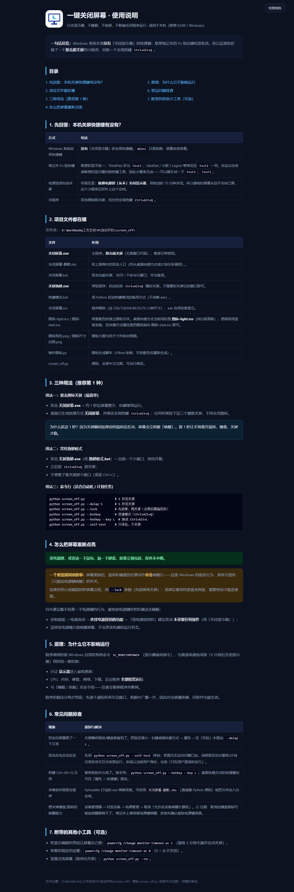
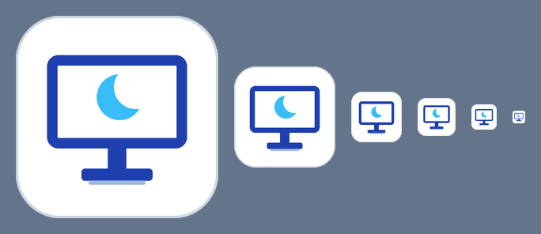
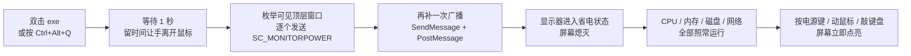

<h1 align="center">ScreenOff · 一键关闭屏幕</h1>

<p align="center">
  <b>双击一下，屏幕黑掉 —— 机器照常运行</b><br>
  <sub>One click to turn the monitor off. Downloads keep running, CPU and network untouched.</sub>
</p>

<p align="center">
  <a href="https://github.com/FaN648512/screen-off/releases/latest"></a>
  <a href="#-核心优势"></a>
  <a href="#-快速开始"></a>
  <a href="#-三种用法"></a>
  <a href="LICENSE"></a>
  <a href="#-常见问题"></a>
</p>

<p align="center">
  <a href="#-核心优势">核心优势</a> ·
  <a href="#-功能特性">功能特性</a> ·
  <a href="#-截图演示">截图演示</a> ·
  <a href="#-快速开始">快速开始</a> ·
  <a href="#-三种用法">三种用法</a> ·
  <a href="#-工作原理">工作原理</a> ·
  <a href="#-和同类工具比有什么不同">差异对比</a> ·
  <a href="#-常见问题">常见问题</a>
</p>

---

<p align="center">
  
</p>

> 上图是随包附带的**中文使用说明页**：深色默认、可一键切浅色、7 个章节把「怎么用 / 怎么点亮 / 关不掉怎么办」逐条讲清。

## 📌 项目简介

**ScreenOff** 是一个 Windows 小工具，只做一件事：**关掉显示器**。

它调用 Windows 自带的显示器省电指令（`SC_MONITORPOWER`），效果等同于你按了显示器上的电源键 —— **只是屏幕不亮**。CPU、内存、磁盘、网络全部照常工作，**下载不会断、后台任务不会停、远程连接不会掉**。

**为什么需要它？** 因为 Windows 本身**没有**「关闭显示器」的全局快捷键（`Win+L` 只是锁屏，屏幕依然亮着）；而电源选项里的自动关屏常常被设成「从不」，插电使用时屏幕永远不会自己黑。

**给谁用？** 想一键熄屏的笔记本用户、显示器电源键按不到的人、想让屏幕先黑但机器继续跑任务的人。

---

## ⭐ 核心优势

| | |
|---|---|
| 🖤 **只关屏幕，不关机器** | 屏幕熄灭，但**不睡眠、不休眠、不断网、不中断任何程序** —— 这是它与「睡眠」最本质的区别 |
| 🎒 **零依赖，拷过去就能跑** | 纯 Python 标准库实现，PyInstaller 打成单文件 exe；目标电脑**不装 Python、不联网、不要管理员权限**，解压双击即用 |
| ⚡ **两种触达方式** | 双击图标立即黑屏；或让 `关屏热键.exe` 常驻后台，任何界面下按 `Ctrl+Alt+Q` 即可 |
| 🛡 **双重投递兜底** | 先**逐个**向可见顶层窗口发送关屏命令，再补一次**广播** —— 兼容那些对广播消息不响应的全屏播放器与旧软件 |
| ⏱ **延迟可调，专治「黑一下又亮」** | 默认延迟 1 秒，留出时间让手离开鼠标；被「手还在鼠标上」坑到时，改成 `--delay 3` 即可 |
| 🔒 **可选锁屏模式** | 加 `--lock` 先锁屏再关屏，屏幕被误触点亮时看到的是登录界面而不是你的桌面 |
| 🎨 **浅色 / 深色双主题图标** | 两套 `.ico`（含 16→256px 六档尺寸），一键切换；放在纯白或深色桌面上都不会「隐形」 |
| 📖 **中文文档覆盖到「关不掉」** | 使用说明页用「现象 → 原因 → 处理」对照表回答高频疑问，不用求人也能自查 |

---

## 🧩 功能特性

| 功能 | 说明 |
|---|---|
| 🖥 **一键关屏** | 双击 `关闭屏幕.exe`，约 1 秒后屏幕熄灭，**无黑框闪现** |
| 🎹 **全局热键常驻** | `关屏热键.exe` 注册 `Ctrl+Alt+Q`（可换成任意字母），任务栏可见运行状态 |
| 🔒 **先锁屏再关屏** | `--lock`：适合离开工位时使用，亮屏需输入密码 |
| 💡 **程序化点亮** | `--on`：脚本里需要恢复屏幕时使用（日常直接按键盘/鼠标即可） |
| ⏱ **自定义延迟** | `--delay 秒数`：默认 1 秒，可按需加长 |
| 🩺 **自检模式** | `--self-test` 只检测接口与环境，**不会真的关屏**，排障时用 |
| 🧰 **零依赖启动器** | 附带 `.bat` / `.vbs` 双入口，`.vbs` 版本完全无窗口闪现 |
| 🪄 **图标与打包全脚本化** | `制作图标.py` 生成图标、`发布打包.py` 一键出绿色版并自动做完整性校验 |

### 命令行参数

```bash
python screen_off.py                  # 1 秒后关屏（默认）
python screen_off.py --delay 3        # 3 秒后关屏，留时间让手离开鼠标
python screen_off.py --lock           # 先锁屏，再关屏
python screen_off.py --on             # 点亮屏幕（程序化恢复用）
python screen_off.py --hotkey         # 常驻后台：按 Ctrl+Alt+Q 关屏
python screen_off.py --hotkey --key L # 换个热键字母（Ctrl+Alt+L）
python screen_off.py --self-test      # 只体检，不关屏
```

| 参数 | 含义 | 默认值 |
|---|---|---|
| `--delay 秒数` | 关屏前等待时间，用来让手指离开鼠标 | `1.0` |
| `--lock` | 先锁屏再关屏（亮屏需密码） | 关闭 |
| `--on` | 改为点亮屏幕 | 关闭 |
| `--hotkey` | 常驻后台并注册全局热键 | 关闭 |
| `--key 字母` | 配合 `--hotkey` 使用，指定热键字母 | `Q` |
| `--self-test` | 仅检测接口可用性，不做实际动作 | 关闭 |

---

## 🖼 截图演示

### 一、随包附带的中文使用说明页

**完整文档（7 个章节）** —— 快捷键现状核实 · 文件清单 · 三种用法 · 如何重新点亮 · 原理说明 · 排查表 · 附带工具：

<p align="center">
  
</p>

深色为默认主题，右上角可一键切到浅色，并记住你的选择。

### 二、图标设计

<p align="center">
  
</p>

「**深色显示器轮廓 + 屏内熄屏月牙**」——一眼读出「这是个屏幕工具，且屏幕已熄灭」。同时提供 light / dark 两套 `.ico`，各含 16 → 256px 六档尺寸，缩到任务栏大小依然清晰。

<p align="center">
  
</p>

---

## 🚀 快速开始

### 方式 A · 下载绿色版（推荐，免安装）

1. 到 [**Releases**](https://github.com/FaN648512/screen-off/releases/latest) 下载 `ScreenOff-portable-v1.0.0.zip`；
2. 解压到任意文件夹（U 盘、桌面都行），**不需要安装**；
3. 双击 **`关闭屏幕.exe`** —— 约 1 秒后屏幕熄灭。

> 只想拿一个文件？Release 里也单独提供了 `ScreenOff.exe`（主程序）与 `ScreenOff-Hotkey.exe`（热键常驻版），单独下载即可使用。

### 方式 B · 从源码运行

需要电脑上有 Python 3.8+（**无需安装任何第三方包**）：

```bash
git clone https://github.com/FaN648512/screen-off.git
cd screen-off/screen_off

python screen_off.py            # 直接关屏
python screen_off.py --self-test  # 先体检，确认接口正常
```

### 方式 C · 自己打包成 exe

```bash
pip install pyinstaller
python 发布打包.py     # 自动打包 + 出绿色版 zip + 完整性自检
```

---

## 🕹 三种用法

### 1. 双击即关屏（推荐）

| 入口 | 说明 |
|---|---|
| `关闭屏幕.exe` | 主程序，**双击就关屏**，无黑框闪现 |
| `关闭屏幕-静默.vbs` | 等价入口，适合放进计划任务或低权限环境 |
| `关闭屏幕.bat` | 命令行入口，需要看输出时使用 |

### 2. 全局热键常驻

双击 `关屏热键.exe`，之后**任何界面下**按 `Ctrl+Alt+Q` 即可关屏；关闭它的小窗口即退出常驻。

> 热键注册失败（提示端口被占用类似的错误码）说明该组合已被其他软件占用，用 `关屏热键.exe --key L` 换一个字母即可。

### 3. 桌面快捷方式（可绑热键）

双击 `创建桌面快捷方式.vbs`，会在桌面生成一个绑定了 `Ctrl+Alt+Q` 的快捷方式。想让快捷方式自带延迟，右键 → 属性，在「目标」末尾追加参数：

```
"C:\你的路径\关闭屏幕.exe" --delay 3
```

---

## ⚙️ 工作原理



**链路要点**

- **投递层**：`SendMessage(WM_SYSCOMMAND, SC_MONITORPOWER, MONITOR_OFF)` —— 这正是 Windows「闲置后自动关屏」所使用的同一条系统消息，因此行为与系统原生完全一致。
- **兜底层**：先逐窗口发送，再发一次广播，最后补一次 `PostMessage`。部分全屏播放器与旧软件不响应广播消息，逐窗口投递能显著提高成功率。
- **不影响运行**：`SC_MONITORPOWER` 只改变**显示器的供电状态**，不触碰系统电源状态机，因此进程、网络连接、文件传输全部不受影响。
- **唤醒**：屏幕熄灭后，按电源键、移动鼠标或敲击键盘都会立即点亮。**这是 Windows 的固定行为，系统没有提供「只允许电源键唤醒」的开关**。

---

## 📁 目录结构

```
screen-off/
├── README.md                     # 本文件
├── LICENSE                       # MIT 许可证
├── docs/
│   ├── 项目优化日志.md            # 从需求到发布的全过程记录 + 同类项目研究
│   ├── guide-hero.png            # 说明页顶部截图（README 主视觉）
│   ├── guide-full.png            # 完整说明页长图
│   ├── icon.png                  # 图标预览
│   └── icon-sizes.png            # 图标六档尺寸对照
└── screen_off/                   # 工具主目录
    ├── screen_off.py             # ★ 核心程序（纯标准库，全中文注释）
    ├── 使用说明.html              # 中文使用说明页（深/浅色可切换，单文件自包含）
    ├── 制作图标.py                # 用 Pillow 代码绘制图标（light / dark 双主题）
    ├── 发布打包.py                # 一键打包绿色版 zip 并做 PE / 自检 / ZIP 完整性校验
    ├── 创建桌面快捷方式.py         # 生成桌面快捷方式并绑定全局热键（pywin32）
    ├── 创建桌面快捷方式.vbs        # 同上，零依赖版本
    ├── 关闭屏幕-静默.vbs           # 无窗口启动入口
    ├── 关闭屏幕.bat                # 命令行启动入口
    ├── 热键模式.bat                # 直接进入热键常驻模式
    ├── 关闭屏幕.ico / 图标-light.ico / 图标-dark.ico
    └── 图标预览.png / 图标尺寸对照.png
```

> 仓库**不包含** `.exe` 与 `.zip` 二进制文件（见 `.gitignore`），成品统一通过 [Releases](https://github.com/FaN648512/screen-off/releases) 分发，以保持仓库轻量、便于克隆。

---

## 🆚 和同类工具比，有什么不同

同类优秀项目（如 [monoff](https://github.com/t-mart/monoff)、[ScreenSleeper](https://github.com/12noonLLC/ScreenSleeper)、[turn-off-screen](https://github.com/LZong-tw/turn-off-screen)）都很出色，本项目与它们的差异在于：

| 对比维度 | 同类标杆常见形态 | ScreenOff |
|---|---|---|
| **上手成本** | 需 Rust 编译、.NET 运行时或 PowerShell 脚本 | **绿色 exe 零依赖**，解压双击即用 |
| **关屏可靠性** | 单次广播消息 | **逐窗口投递 + 广播双重兜底**，兼容不响应广播的程序 |
| **占用与安全面** | 常驻服务 / 开放 HTTP 端口 | **默认用完即走**，不监听端口、不常驻（热键模式按需常驻） |
| **文档语言** | 以英文为主 | **中文文档全覆盖**，含「黑一下又亮」「关不掉」等实操排查 |
| **视觉资产** | 多数使用默认图标 | 语义化图标 + 深浅双主题 + 六档尺寸，可一键重新生成 |

> 本项目在设计时参考了上述项目的思路（延迟的必要性、状态可感知、单一职责），完整研究结论见 [`docs/项目优化日志.md`](docs/项目优化日志.md)。

---

## ❓ 常见问题

<details>
<summary><b>屏幕黑了一下又立刻亮起来？</b></summary>

关屏瞬间你的手还停留在鼠标或触控板上，那一下微小移动就把屏幕唤醒了。解决办法是用延迟：给快捷方式的「目标」末尾加 `--delay 3`，按下热键后 3 秒内把手移开即可。程序默认已经延迟 1 秒，如果仍被唤醒就继续加大。
</details>

<details>
<summary><b>能不能只允许「电源键」唤醒，鼠标键盘不唤醒？</b></summary>

**不能。** 这是 Windows 的固定行为，系统没有提供限制唤醒源的开关。如果你担心误触后被别人看到桌面，用 `--lock` 参数：它会先锁屏再关屏，屏幕被点亮时显示的是登录界面。
</details>

<details>
<summary><b>按电源键会不会让电脑睡眠？</b></summary>

默认可能不会，但建议主动确认一次：「控制面板 → 电源选项 → 选择电源按钮的功能」，把「按电源按钮时」设为**不采取任何操作**或「关闭显示器」。这样按电源键只会点亮屏幕，不会误入睡眠。
</details>

<details>
<summary><b>首次运行时被 Windows SmartScreen 或杀毒软件拦住？</b></summary>

这是所有 PyInstaller 打包程序的通病——不是病毒，只是「这个程序没见过、没有数字签名」。点「更多信息 → 仍要运行」，或把所在文件夹加入杀软白名单即可。想彻底放心，可以直接用方式 B 从源码运行，代码只有 170 行、全中文注释。
</details>

<details>
<summary><b>它和「睡眠」「休眠」有什么区别？</b></summary>

| | 屏幕 | 程序运行 | 网络 / 下载 | 唤醒速度 |
|---|---|---|---|---|
| **ScreenOff** | 熄灭 | ✅ 照常 | ✅ 不断 | 立即 |
| 睡眠（S3） | 熄灭 | ❌ 暂停 | ❌ 断开 | 数秒 |
| 休眠（S4） | 熄灭 | ❌ 停止 | ❌ 断开 | 较慢 |
| 关机 | 熄灭 | ❌ 停止 | ❌ 断开 | 开机时间 |

ScreenOff 只动屏幕，不动系统电源状态——这就是它的全部价值。
</details>

<details>
<summary><b>关屏会不会影响远程桌面 / 远程控制？</b></summary>

不会中断连接，但**远程端看到的也是黑屏**（因为屏幕确实关了）。如果你需要「本机黑屏、远程仍能看到画面」，那要用「虚拟黑遮罩」方案而非真正关屏，本项目不提供该能力。
</details>

<details>
<summary><b>支持多显示器 / 只想关其中一个吗？</b></summary>

当前版本会关闭**所有**显示器。按显示器编号单独关闭在路线图中。
</details>

---

## 🗺 路线图

- [ ] 系统托盘常驻模式，可一眼看出工具是否在运行
- [ ] 支持按显示器编号只关其中一块屏
- [ ] `--idle` 空闲自动关屏（配合延迟与锁屏组合）
- [ ] 可选「关屏同时暂停媒体播放」
- [ ] 通过 winget / Scoop 分发，进一步降低安装摩擦
- [ ] 图形化设置界面（可选参数不用记）

---

## 🤝 贡献

欢迎提交 Issue 与 Pull Request。提报问题时，麻烦附上这三项信息，能大幅加快定位速度：

1. 系统版本（`winver` 的结果）与是否为笔记本；
2. 运行的命令或你双击了哪个文件；
3. `python screen_off.py --self-test` 的输出。

---

## 📄 许可证

[MIT](LICENSE) —— 可自由使用、修改与再分发。

---

## 🙏 致谢

设计思路参考了这些优秀项目：

- [t-mart/monoff](https://github.com/t-mart/monoff) —— 「延迟不是可选项而是刚需」的洞察
- [LZong-tw/turn-off-screen](https://github.com/LZong-tw/turn-off-screen) —— 状态可感知与硬件兼容的处理思路
- [12noonLLC/ScreenSleeper](https://github.com/12noonLLC/ScreenSleeper) —— 参数组合的表达方式
- [emoacht/Monitorian](https://github.com/emoacht/Monitorian) —— 现代 Windows 应用的深浅主题体验

如果这个工具帮你省下了一次弯腰按显示器电源键的功夫，欢迎点个 ⭐ Star。
